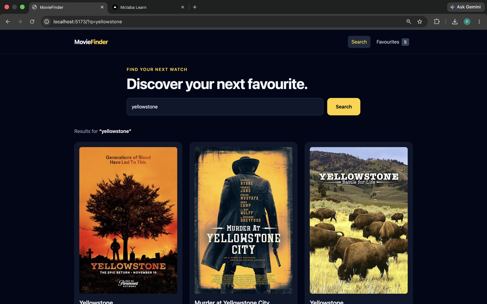
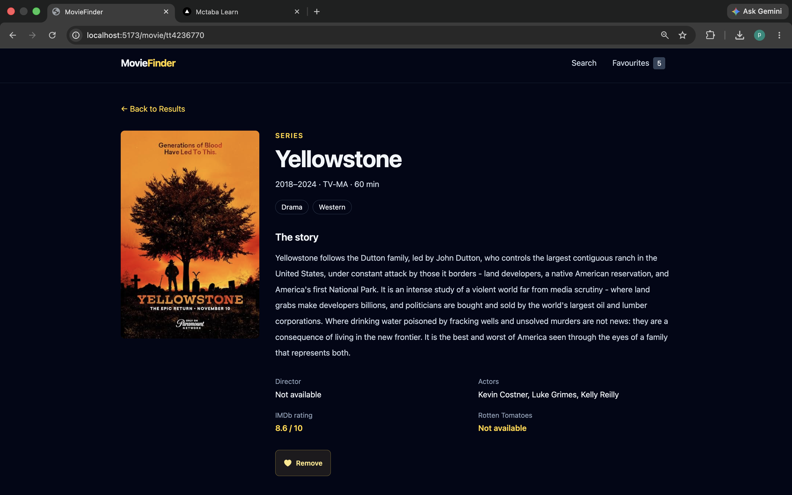
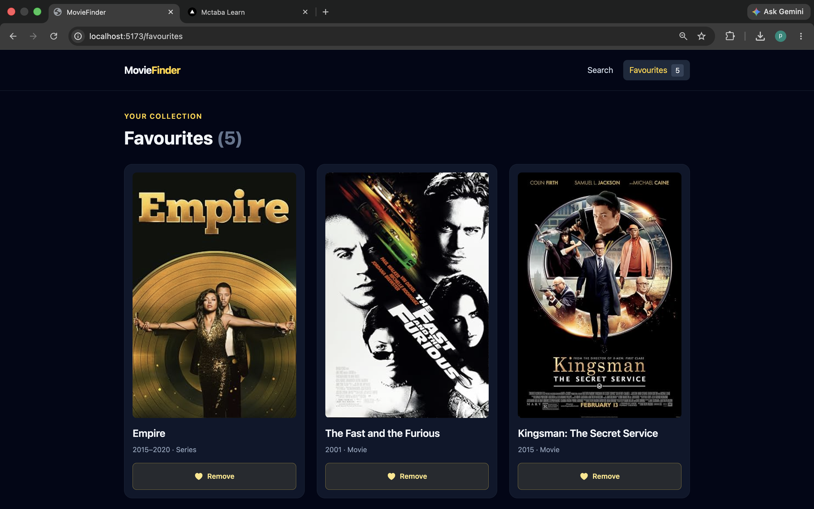
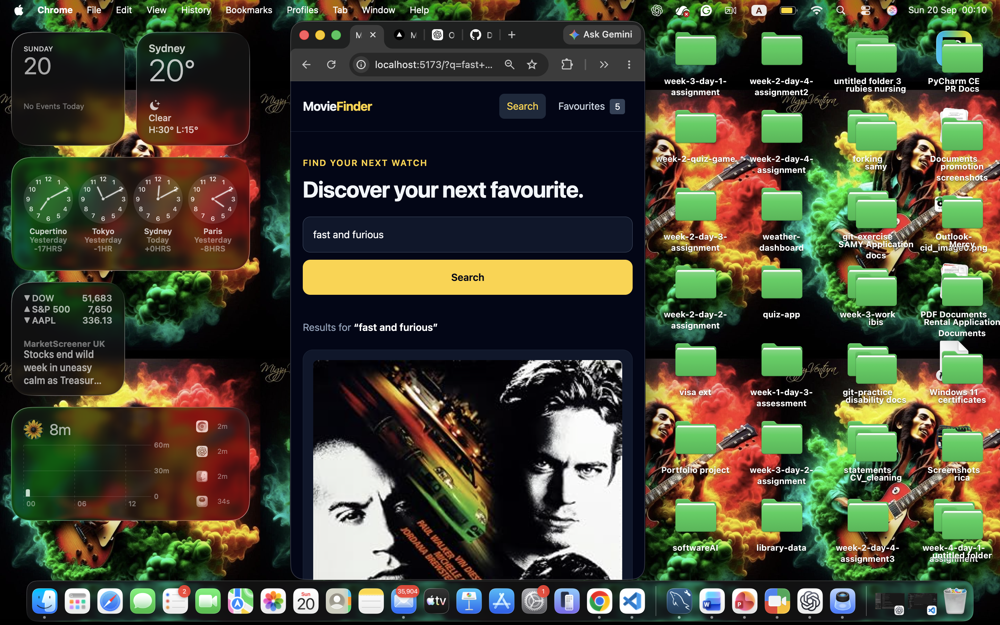

# 🎬 MovieFinder

MovieFinder is a responsive movie discovery application built with **React** and powered by the **OMDb API**. Users can search for movies, view detailed information, and save favourites using browser storage.

## 🌐 Live Demo

[Open MovieFinder](https://week-4-movie-search-app.vercel.app/)


---

## ✨ Features

* 🔎 Search for movies, series, and episodes
* 🎬 View movie details including plot, cast, genre, runtime, and ratings
* ❤️ Add and remove favourite movies
* 💾 Save favourites using `localStorage`
* 📱 Responsive mobile, tablet, and desktop layout
* 🧭 Client-side navigation using React Router
* ⏳ Loading, error, and empty states
* 🖼️ Fallback poster when a movie poster is unavailable

---

## 🛠️ Technologies

| Technology   | Purpose                    |
| ------------ | -------------------------- |
| React        | User interface             |
| Vite         | Development and build tool |
| React Router | Navigation                 |
| Tailwind CSS | Styling                    |
| OMDb API     | Movie data                 |
| localStorage | Save favourites            |
| Vercel       | Deployment                 |

---

## 📂 Project Structure

```text
moviefinder/
│
├── public/
│   
│
├── screenshots/
│   ├── search-results.png
│   ├── movie-details.png
│   ├── favourites-page.png
│   └── mobile-view.png
│
├── src/
│   ├── components/
│   │   ├── Header.jsx
│   │   ├── SearchBar.jsx
│   │   └── MovieCard.jsx
│   │
│   ├── hooks/
│   │   └── useFavourites.js
│   │
│   ├── pages/
│   │   ├── Home.jsx
│   │   ├── MovieDetails.jsx
│   │   ├── Favourites.jsx
│   │   └── NotFound.jsx
│   │
│   ├── services/
│   │   └── omdb.js
│   │
│   ├── App.jsx
│   ├── main.jsx
│   └── index.css
│
├── .env.local
├── .gitignore
├── package.json
├── vercel.json
└── README.md
```

The `poster-placeholder.jpg` file is displayed when a movie does not have an available poster.

---

## 🚦 Routes

| Route            | Description       |
| ---------------- | ----------------- |
| `/`              | Movie search page |
| `/?q=Batman`     | Search results    |
| `/movie/:imdbID` | Movie details     |
| `/favourites`    | Saved favourites  |

---

## ⚙️ Getting Started

Clone the repository and install dependencies:

```bash
git clone https://github.com/Dominic-kores/week-4-movie-search-app
cd week-4-movie-search
npm install
```

Create a `.env.local` file:

```env
VITE_OMDB_API_KEY=your_actual_key_here
```

Start the application:

```bash
npm run dev
```

---

## 📜 Commands

```bash
npm run dev
npm run lint
npm run build
npm run preview
```

---

## 📸 Screenshots













---

## ☁️ Deployment

The application is deployed using **Vercel**.

1. Push the project to GitHub.
2. Import the repository into Vercel.
3. Select **Vite**.
4. Set the build command to `npm run build`.
5. Set the output directory to `dist`.
6. Add `VITE_OMDB_API_KEY` to Vercel environment variables.
7. Deploy.

---

## 🚀 Future Improvements

* Pagination
* Search history
* Movie filters
* Dark mode
* User accounts
* Cloud-based favourites

---

## 🙏 Acknowledgements

Movie data is provided by the [OMDb API](https://www.omdbapi.com/).

## 👨‍💻 Author

**Dominic Kores**
**Software Engineer**

---

⭐ Built as part of my React and API development learning journey.
